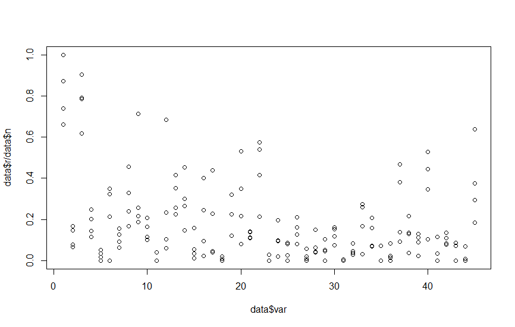
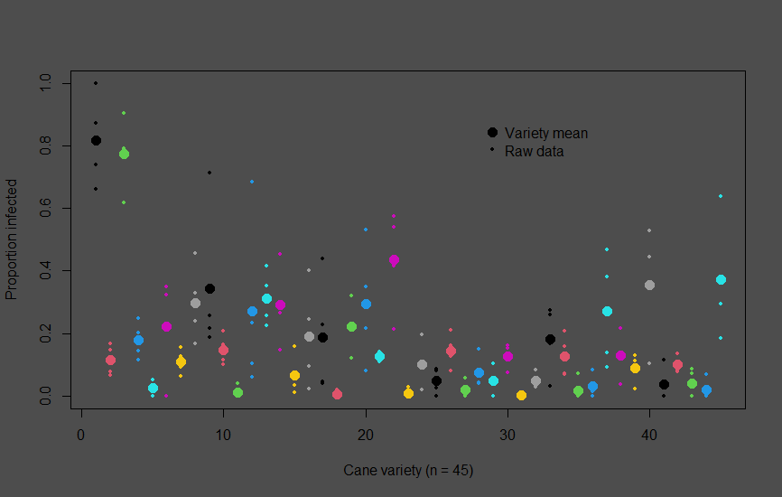

## My test repo

This test-project is part of a Github tutorial at the Data Science Garage Bootcamp

https://dsgarage.netlify.app/bootcamp/

## Bad graph

### Bad graph R code
plot(y = data$r/data$n,
      x = data$var)
      

### Better graph R code

#### Set plot background colour
par(bg = "grey30")

#### Create graph
plot(y = data$r/data$n, 
     x = data$var,
     xlab = "Cane variety (n = 45)",
     ylab = "Proportion infected",
     col = data$var,
     pch = 19,
     cex = .5)
     
#### Calculate mean for each variety and add to graph
data$var <- factor(data$var)
var_mean <- aggregate(x = data$r/data$n,
                      by = list(variety = data$var),
                      FUN = mean)
var_mean
points(x = var_mean$variety,
       y = var_mean$x,
       col = var_mean$variety,
       pch = 19,
       cex = 1.5)
       
#### Add legend to graph
legend(x = 28, y = 0.9,
       legend = c("Variety mean", "Raw data"),
       pch = c(19, 19),
       pt.cex = c(1.5, .5),
       col = c("black", "black"),
       bty = "n")
       

